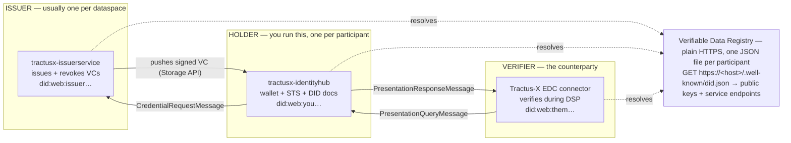
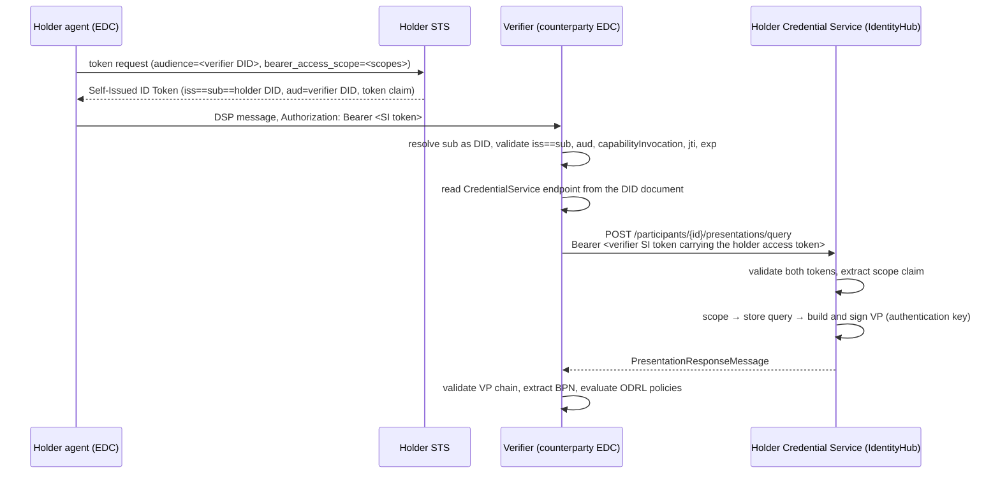

# Concepts and Upstream Relationship

An orientation guide for developers new to the Tractus-X Identity Hub: what DIDs, Verifiable
Credentials and the Decentralized Claims Protocol (DCP) actually are, who plays the Issuer,
Holder and Verifier roles, which API does what — and precisely where this repository stops being
[eclipse-edc/IdentityHub](https://github.com/eclipse-edc/IdentityHub).

Ports, states and endpoint paths below were read from this repository at **EDC 0.17.0**. Treat the
API version segment and the Admin API path as deployment-specific.

## Table of Contents

- [1. The one-page map](#1-the-one-page-map)
- [2. DIDs: the identifier and the document](#2-dids-the-identifier-and-the-document)
- [3. Verifiable Credentials and Presentations](#3-verifiable-credentials-and-presentations)
- [4. Issuer, Holder, Verifier — who is who](#4-issuer-holder-verifier--who-is-who)
- [5. Presentation flow — the verifier pulls](#5-presentation-flow--the-verifier-pulls)
- [6. Issuance flow — asynchronous by design](#6-issuance-flow--asynchronous-by-design)
- [7. The domain objects you will actually touch](#7-the-domain-objects-you-will-actually-touch)
- [8. The APIs, and which are exposed](#8-the-apis-and-which-are-exposed)
- [9. Scopes: how a policy becomes a query](#9-scopes-how-a-policy-becomes-a-query)
- [10. Upstream vs Tractus-X: what actually differs](#10-upstream-vs-tractus-x-what-actually-differs)
- [11. Where to start in the repository](#11-where-to-start-in-the-repository)
- [Primary sources](#primary-sources)
- [NOTICE](#notice)

---

## 1. The one-page map

The **Dataspace Protocol (DSP)** defines how two connectors exchange catalogs, negotiate contracts
and move data. It deliberately says nothing about how a participant *proves* who it is. That hole
is filled by the **Decentralized Claims Protocol (DCP)**, an Eclipse Dataspace Working Group
specification (v1.0 released July 2025, current v1.0.1).

DCP makes three commitments:

1. Every participant is identified by a **W3C DID**, not a hostname or a client ID.
2. Every DSP message carries a **self-issued JWT** signed by that participant.
3. When the receiver wants to know what the sender is entitled to, it **calls back to the sender's
   wallet** and pulls a Verifiable Presentation.

IdentityHub is the EDC implementation of DCP. It is two runtimes, not one.



Two things follow that are easy to miss:

- **These are roles per message, not companies.** Every participant is simultaneously a Holder and
  a Verifier. The Verifier is not a separate product — it is the counterparty's EDC control plane.
- **The wallet is a server with a public HTTPS endpoint**, not an app on a phone. There is no human
  clicking "approve". Consent is expressed in advance, as a scope, by the machine. That single fact
  explains almost every design difference between DCP and OpenID4VP.

## 2. DIDs: the identifier and the document

A **DID** (Decentralized Identifier) is a URI of the form `did:<method>:<id>` that resolves — by
rules the method defines, not by asking a registry — to a **DID document**: a JSON object holding
public keys and service endpoints. Whoever holds the private keys controls the identity.

Catena-X fixes the method to **`did:web`**, which replaces a blockchain with DNS + TLS + a static
file. Resolution is mechanical:

| DID | resolves to |
| :-- | :-- |
| `did:web:example.com` | `https://example.com/.well-known/did.json` |
| `did:web:example.com:foo` | `https://example.com/foo/did.json` |
| `did:web:example.com%3A3000` | `https://example.com:3000/.well-known/did.json` |
| `did:web:issuerservice%3A10100:issuer` | `http(s)://issuerservice:10100/issuer/did.json` — the Docker Compose form used in this repository |

Colons become slashes, `%3A` decodes back to a colon (that is how ports survive), and
`/.well-known` is inserted only when there was no path component.

The consequence worth stating out loud: **whoever controls the domain controls the identity**.
There is no cryptographic anchor below web PKI. Catena-X compensates with governance — a curated
list of trusted issuer DIDs that every connector is configured with.

### What is in the document

```json
{
  "id": "did:web:identity-hub.example.com",
  "verificationMethod": [{
    "id": "did:web:identity-hub.example.com#key-1",
    "type": "JsonWebKey2020",
    "controller": "did:web:identity-hub.example.com",
    "publicKeyJwk": { "kty": "EC", "crv": "P-256", "x": "…", "y": "…" }
  }],
  "authentication":       ["…#key-1"],
  "assertionMethod":      ["…#key-1"],
  "capabilityInvocation": ["…#key-1"],
  "service": [{
    "id": "https://identity-hub.example.com#credential-service",
    "type": "CredentialService",
    "serviceEndpoint": "https://identity-hub.example.com/api/credentials/v1alpha/participants/<id>"
  }]
}
```

`verificationMethod` holds the key material. The three arrays below it are **verification
relationships** — they declare what each key is *allowed to do*, and DCP is strict about which one
it checks:

| Relationship | Meaning | Where DCP requires it |
| :-- | :-- | :-- |
| `authentication` | proving you are the subject | the key that signs a **Verifiable Presentation** |
| `assertionMethod` | making claims about others | an **issuer's** credential-signing key |
| `capabilityInvocation` | invoking a capability | the key that signs a **Self-Issued ID Token** |

If a verifier sees no `kid` header and more than one candidate `capabilityInvocation` key, it must
reject the token.

`service` is how discovery works. There is no directory: the verifier reads
`type: "CredentialService"` out of your DID document to learn where to send its presentation query,
and a holder reads `type: "IssuerService"` to learn where to send a credential request.

**Key rotation** is therefore a document operation: publish the new key, start signing with it,
keep the old `verificationMethod` published until everything it signed has expired, then remove it.
Revocation is the same minus the grace period. IdentityHub models this as a state machine —
`CREATED → ACTIVATED → ROTATED → REVOKED` — with dedicated Identity API endpoints for each
transition.

## 3. Verifiable Credentials and Presentations

A **Verifiable Credential (VC)** is a signed statement by an issuer about a subject:

```json
{
  "@context": ["https://www.w3.org/2018/credentials/v1"],
  "type": ["VerifiableCredential", "MembershipCredential"],
  "issuer": "did:web:issuer-service.example.com",
  "issuanceDate": "2026-01-14T09:00:00Z",
  "expirationDate": "2027-01-14T09:00:00Z",
  "credentialSubject": {
    "id": "did:web:identity-hub.example.com",
    "holderIdentifier": "BPNL00000003AYRE"
  },
  "credentialStatus": {
    "type": "BitstringStatusListEntry",
    "statusPurpose": "revocation",
    "statusListIndex": "94567",
    "statusListCredential": "https://issuer.example.com/statuslist/…"
  }
}
```

Three fields carry the weight:

- `issuer` — a DID whose signing key must have `assertionMethod`.
- `credentialSubject.id` — the holder's DID. This binds the credential to a wallet, so a stolen
  credential cannot be replayed by someone else.
- `credentialStatus` — the revocation hook.

### A Verifiable Presentation is not a credential

A **VP** is a wrapper the *holder* signs around one or more VCs, at query time, for one verifier.
The VC proves "the issuer said this about me". The VP proves "and I am the one holding it, right
now, talking to you". Verification is a chain:

1. The VP matches the requested scope.
2. The VP signature verifies, and its key has `authentication` in the holder's DID document.
3. Each enclosed VC's signature verifies against its `issuer` DID.
4. That issuer is in the verifier's **trusted issuer list**.
5. The status list says not revoked, not suspended.
6. Validity dates hold.

Any failure invalidates the whole presentation.

### Revocation without phoning home

DCP mandates **BitstringStatusList**. The issuer publishes one large credential containing a
gzip-compressed bitstring; each issued VC carries an index into it. Checking revocation means
fetching a list of at least 131,072 entries and reading one bit — so the issuer learns nothing
about which credential was being checked. IssuerService serves these on its public `/statuslist`
endpoint, and IdentityHub's credential watchdog re-checks stored credentials periodically.

### Format profiles

DCP pins two combinations rather than leaving the stack combinatorial:

| Profile | Data model | Revocation | Proof |
| :-- | :-- | :-- | :-- |
| `vc20-bssl/jwt` | VC Data Model 2.0 | BitstringStatusList | enveloped JOSE |
| `vc11-sl2021/jwt` | VC Data Model 1.1 | StatusList2021 | external JWT |

The [DCP API walkthrough](../usage/dcp-api-walkthrough/README.md) in this repository issues
`VC1_0_JWT`. A VP and the VCs inside it must use the same data model and proof mechanism.

## 4. Issuer, Holder, Verifier — who is who

| Role | Runs | Responsibilities |
| :-- | :-- | :-- |
| **Issuer** | `tractusx-issuerservice` | Asserts claims by signing VCs. In Catena-X this is the dataspace authority / onboarding side — the Portal assigns the BPNL, records the signed framework agreement and drives issuance. Publishes an `IssuerService` endpoint in its DID document, maintains revocation status lists, rotates its own signing key. Operated centrally; every connector is configured with its DID in a trusted-issuer list. |
| **Holder** | `tractusx-identityhub` | Every participant. Runs three things DCP names separately but this runtime bundles: the **Credential Service** (stores VCs, answers presentation queries, accepts pushed credentials), the **STS** (mints self-issued tokens, internal-only, must be embedded), and the **DID service** (serves `did.json`). The subject of a credential is normally also its holder. |
| **Verifier** | the counterparty's EDC control plane | Not a separate product. When your connector sends a catalog request, contract request or transfer request, the receiving control plane is the Verifier: it validates your token, resolves your DID, calls your IdentityHub for a presentation, and evaluates its ODRL policies against the credentials it gets back. |
| **Participant Agent** | `tractusx-edc` control plane | Your own connector. It decides which scopes a given DSP message needs, asks your STS for a token, and attaches it. IdentityHub never speaks DSP itself. |
| **Super-user** | `SuperUserSeedExtension` | An operational role, not a protocol one. The only principal allowed to create Participant Contexts. Seeded at first boot; its API key is printed to the log exactly once. |

### Why there are two identifiers

Catena-X participants have both a **BPNL** (`BPNL0000000000XX`, the legally binding identifier
assigned at onboarding) and a **DID** (the cryptographically verifiable one). They solve different
problems: a participant can re-host its wallet and get a new `did:web` without invalidating signed
contracts, because the BPNL is stable.

The BPNL always travels *inside* a credential —
`MembershipCredential.credentialSubject.holderIdentifier` — never as a bare self-declaration. Since
there is no algorithmic mapping between the two identifiers, a separate service (**BDRS**, the
BPN/DID Resolution Service) publishes the directory, and authenticates its own callers with their
MembershipCredential.

## 5. Presentation flow — the verifier pulls

This is the flow that runs on every DSP message, thousands of times a day.



Step by step:

| # | Actor | What happens |
| --: | :-- | :-- |
| 1 | Holder agent | About to send a catalog request. From the policy it expects to face, it derives the scopes it is willing to expose and asks its own **STS** for a token: `audience=<verifier DID>`, `bearer_access_scope=<scopes>`. |
| 2 | STS | Returns a **Self-Issued ID Token**: `iss == sub == your DID`, `aud = verifier DID`, `jti`, `exp` (5 min default) — plus a `token` claim holding an opaque access token that encodes the granted scopes. **The `token` claim *is* the consent.** No scope in, no token claim out. |
| 3 | Holder agent | Sends the DSP message with `Authorization: Bearer <SI token>`. |
| 4 | Verifier | Resolves `sub` as a DID, fetches the DID document, validates the token: `iss == sub`, `aud` is its own DID, signing key carries `capabilityInvocation`, `jti` unseen, not expired. |
| 5 | Verifier | Reads the `CredentialService` service entry from that same DID document — that is how it learns your IdentityHub's address. |
| 6 | Verifier | Mints **its own** SI token, carrying *your* access token in *its* `token` claim, and calls `POST <your CS>/participants/{id}/presentations/query` with a `PresentationQueryMessage` listing scopes. |
| 7 | IdentityHub | `SelfIssuedTokenVerifier` validates the outer token, unpacks the embedded access token, checks its `aud` matches your DID, and extracts the `scope` claim. |
| 8 | IdentityHub | Turns each scope into a store query (`CredentialQueryResolver`), builds a VP over the matching credentials, signs it with the `authentication` key, and returns a `PresentationResponseMessage`. Asking for scopes you are not entitled to returns 2xx with *fewer* credentials — not an error. |
| 9 | Verifier | Validates the VP chain, loads the credentials into its `ParticipantAgent` claims, extracts the BPN from the MembershipCredential, and evaluates its access and usage policies. |

> [!NOTE]
> **Why not OpenID4VP?** OID4VP is redirect-based: the verifier sends an authorization request and
> the *wallet pushes* the presentation back after a human approves it. DCP inverts that — the
> *verifier pulls*, because there is no human, and because a VP is too large to ride in an HTTP
> header. That inversion is the whole reason IdentityHub is a public server rather than a client.

## 6. Issuance flow — asynchronous by design

Issuance is deliberately not request/response. The issuer acknowledges receipt, then decides —
possibly after a human approves — and **pushes** the credential to the wallet later. This is what
makes manual onboarding approval a first-class case rather than a workaround.

### What an operator configures first

| Object | Endpoint | Answers |
| :-- | :-- | :-- |
| **AttestationDefinition** | `POST …/attestations` | *How do I check this claim is true?* Bundled types: `database` (look the holder up in the `holders` table), `holder`, plus `presentation` and `external`. An attestation produces claims. |
| **CredentialDefinition** | `POST …/credentialdefinitions` | *What may be issued, and what goes in it?* Ties a `credentialType` and `format` to a list of attestations, a JSON schema, a `validity`, optional `rules`, and **`mappings`** — `{input, output, required}` triples that copy attestation claims into the credential subject, e.g. `did → credentialSubject.id`, `holder_id → credentialSubject.holderIdentifier`. |
| **Holder** | `POST …/holders` | *Whose requests do I even consider?* Registers a holder's `did` and `holderId`. This is also the row the `database` attestation reads. |
| **CredentialRuleDefinition** | inside a credential definition | *Under what condition do I refuse?* The bundled `expression` type evaluates `{claim, operator, value}` against the attestation output, e.g. `onboarding.signedDocuments eq true`. Failure means HTTP 401, before any credential exists. |

### Then the flow

```mermaid
sequenceDiagram
    participant Admin
    participant IH as IdentityHub (Holder)
    participant IS as IssuerService (Issuer)

    Admin->>IH: POST /participants/{id}/credentials/request
    Note over IH: HolderCredentialRequest = CREATED
    IH->>IH: resolve issuer DID doc → IssuerService endpoint; get SI token from STS
    IH->>IS: CredentialRequestMessage (Bearer SI token)
    Note over IH: state = REQUESTING
    IS->>IS: validate SI token, look up holder
    IS->>IS: run attestation pipeline, then evaluate rules
    IS->>IS: create IssuanceProcess (SUBMITTED), check external approval
    IS-->>IH: acknowledgement + status location
    Note over IH: state = REQUESTED

    loop poll
        IH->>IS: GET /requests/{credentialRequestId}
        IS-->>IH: RECEIVED | ISSUED | REJECTED
    end

    IS->>IS: apply mappings, sign VC (assertionMethod key), allocate status-list index
    Note over IS: IssuanceProcess = APPROVED
    IS->>IH: POST /participants/{id}/credentials (Storage API)
    Note over IS: IssuanceProcess = DELIVERED
    IH->>IH: verify signature, store VerifiableCredentialResource (ISSUED)
```

Points that trip people up:

- The response to a `CredentialRequestMessage` is an **acknowledgement plus a status URL**. It is
  not the credential.
- The issuer keeps issuance *metadata*, not the full credential. The holder's wallet is the only
  home of the VC.
- Rule failure produces HTTP 401 during the synchronous stage, before any `IssuanceProcess` exists.

Two variations use the same machinery. **Credential offers** (`POST …/offers`) let the issuer
initiate — typically `offerReason: reissue` ahead of expiry, or `proof-key-revocation` after a key
compromise; an offer does not create an issuance process, it prompts the holder to send a normal
request. **Re-issuance** is architecturally identical to issuance, driven by the credential
manager's renewal grace period.

## 7. The domain objects you will actually touch

All of these come from upstream SPI modules. Tractus-X does not redefine any of them.

| Object | Side | What it is | States |
| :-- | :-- | :-- | :-- |
| `ParticipantContext` | both | The tenant boundary. Owns every DID, key and credential; deletion cascades. Created from a `ParticipantManifest` (`did`, keys, service endpoints, roles). Only a super-user may create one. | `CREATED → ACTIVATED → DESTROYED` |
| `KeyPairResource` | holder | One key pair, with `keyId`, `privateKeyAlias` (vault), duration and rotation policy. Rotation emits events the DID module reacts to. | `CREATED → ACTIVATED → ROTATED → REVOKED` |
| `DidResource` | both | The DID document plus its publication state. Only `did:web` has a bundled publisher. | `INITIAL → GENERATED → PUBLISHED → UNPUBLISHED` |
| `VerifiableCredentialResource` | holder | A stored VC plus issuance/reissuance policy and metadata. The same class is reused issuer-side to track what was issued. | `INITIAL → REQUESTING → REQUESTED → ISSUING → ISSUED`, then `REVOKED / SUSPENDED / EXPIRED` |
| `HolderCredentialRequest` | holder | One outstanding request to an issuer, tracked by `holderPid` (yours) and `issuerPid` (theirs). | `CREATED → REQUESTING → REQUESTED → ISSUED / ERROR` |
| `Holder` | issuer | A registered counterparty: `holderId`, `did`, name, properties. The `database` attestation reads this table. | — |
| `AttestationDefinition` | issuer | `{id, attestationType, configuration}`, resolved at runtime through a factory registry. | — |
| `CredentialDefinition` | issuer | Type, format, schema, validity, attestations, rules, mappings, additional JSON-LD contexts. | — |
| `IssuanceProcess` | issuer | One issuance in flight, with its resolved claims and target definitions. | `SUBMITTED → APPROVED → DELIVERED`, or `ERRORED` |

> [!NOTE]
> There is no `MembershipCredential` class anywhere in IdentityHub. Credential types are
> **configuration** — a `CredentialDefinition` row on the issuer, with a JSON schema URL pointing at
> [tractusx-profiles](https://github.com/eclipse-tractusx/tractusx-profiles). The Catena-X semantics
> (which policy constraint maps to which credential type, BPN extraction, the trusted issuer list)
> live in [tractusx-edc](https://github.com/eclipse-tractusx/tractusx-edc), not here.

See [IdentityHub](./components/IdentityHub.md) and [IssuerService](./components/IssuerService.md)
for the full data models and entity relationships.

## 8. The APIs, and which are exposed

Both runtimes serve several independent web contexts, each on its own port and path. The
internal/public split is the single most important operational fact in this document: **the STS and
the Identity API must never be reachable from the internet**, and the Credentials and DID contexts
must be.

### IdentityHub

| Context | Path | Compose | Helm | Exposure | Purpose |
| :-- | :-- | --: | --: | :-- | :-- |
| `identity` | `/api/identity` | 15151 | 8082 | **internal** | Manage participants, DIDs, key pairs, credentials |
| `credentials` | `/api/credentials` | 13131 | 8083 | public | DCP: presentation query, storage, offers |
| `did` | `/` | 10100 | 8084 | public | `/.well-known/did.json` |
| `sts` | `/api/sts` | 9292 | 8087 | **internal** | `POST /token` — self-issued tokens |
| `default` | `/api` | 8181 | 8081 | **internal** | Health, version |

### IssuerService

| Context | Path | Compose | Helm | Exposure | Purpose |
| :-- | :-- | --: | --: | :-- | :-- |
| `issuance` | `/api/issuance` | 13132 | 8082 | public | DCP: credential request, status, metadata |
| `issueradmin` | `/api/issuer` · `/api/admin` | 15152 | 8086 | **internal** | Attestations, credential definitions, holders, revocation |
| `identity` | `/api/identity` | 15251 | 8087 | **internal** | Same Identity API as IdentityHub |
| `did` | `/` | 10101 | 8083 | public | Issuer DID document |
| `statuslist` | `/statuslist` | 9999 | 8088 | public | Revocation status list credentials |
| `sts` | `/api/sts` | 9392 | 8085 | **internal** | Issuer's own token minting |

> [!WARNING]
> The Admin API path differs between deployments — `/api/issuer` on Docker Compose, `/api/admin`
> under Helm. Always use the full base-URL variable, never a hardcoded path. See
> [Prerequisites](../usage/dcp-api-walkthrough/00_prerequisites.md).

### Identity API — the one you will drive most

Authenticated with `x-api-key: base64url(<participantContextId>).<token>`. Note that the prefix
stays base64url-encoded while **URL path segments use the plain id** since EDC 0.17.0 — a very
common source of 404s when following older examples.

| Method | Path | Does |
| :-- | :-- | :-- |
| `POST` | `/participants` | Create a participant context — super-user only; returns the new API key and STS client secret |
| `POST` | `/participants/{id}/state?isActive=true` | Activate — this is what publishes the DID document |
| `PUT` | `/participants/{id}/keypairs` | Add a key pair (generated, or private key already in the vault) |
| `POST` | `/participants/{id}/keypairs/{kid}/rotate` | Retire a key, optionally minting a successor |
| `POST` | `/participants/{id}/dids/publish` | Publish / re-publish the DID document |
| `POST` | `/participants/{id}/dids/{did}/endpoints` | Add a service endpoint — how the `CredentialService` entry gets there |
| `POST` | `/participants/{id}/credentials/request` | Trigger DCP issuance against an issuer DID |
| `GET` | `/participants/{id}/credentials/request/{holderPid}` | Status of that request |
| `GET` | `/participants/{id}/credentials?type=` | List stored credentials |

### Issuer Admin API

| Method | Path | Does |
| :-- | :-- | :-- |
| `POST` | `/participants/{id}/attestations` | Define how a claim is verified |
| `POST` | `/participants/{id}/credentialdefinitions` | Define what can be issued and how claims map in |
| `POST` | `/participants/{id}/holders` | Register a holder |
| `POST` | `/participants/{id}/credentials/{credId}/revoke` | Flip the status-list bit |
| `POST` | `/participants/{id}/credentials/offer` | Push an offer to a holder |
| `POST` | `/participants/{id}/issuanceprocesses/query` | Inspect issuance state — the first place to look when a credential never arrives |

### The DCP wire APIs

These are what the protocol actually specifies; everything above is management convenience.

| Served by | Endpoint | Message |
| :-- | :-- | :-- |
| Credential Service | `POST /participants/{id}/presentations/query` | `PresentationQueryMessage` → `PresentationResponseMessage` |
| Credential Service | `POST /participants/{id}/credentials` | `CredentialMessage` — the issuer pushing an issued VC |
| Credential Service | `POST /participants/{id}/offers` | `CredentialOfferMessage` |
| Issuer Service | `POST /participants/{id}/credentials` | `CredentialRequestMessage` — note the deliberate path collision with storage; different base URL, opposite direction |
| Issuer Service | `GET /participants/{id}/requests/{reqId}` | `CredentialStatus` |
| Issuer Service | `GET /participants/{id}/metadata` | `IssuerMetadata` — the catalogue of issuable `CredentialObject`s |

> [!IMPORTANT]
> **Check the version segment before copying a curl.** This repository is pinned to EDC /
> IdentityHub **0.17.0**, and its walkthrough and collections use `/v1alpha/…`. Upstream `main` has
> since promoted these APIs to `/v1` and marked them stable on the way to 1.0.0. Whichever you are
> on, take the version segment from the OpenAPI of your actual build, not from a document.

See [API Documentation](../api/README.md) for the OpenAPI specification and the Postman and Bruno
collections.

## 9. Scopes: how a policy becomes a query

A DCP scope is an alias for "which credentials may this verifier see". The grammar is
`<alias>:<discriminator>`, and the EDC implementation appends an operation:

```text
org.eclipse.tractusx.vc.type:MembershipCredential:read
org.eclipse.dspace.dcp.vc.type:MembershipCredential:read
org.eclipse.dspace.dcp.vc.id:8247b87d-8d72-47e1-8128-9ce47e3d829d:read
```

DCP mandates two baseline aliases (`…dcp.vc.type` and `…dcp.vc.id`); a dataspace may add its own,
and **Catena-X uses `org.eclipse.tractusx.vc.type`**. The three scopes a Catena-X connector requests
by default are MembershipCredential, BpnCredential and DataExchangeGovernanceCredential.

The chain from a written policy to a store query runs:

```text
ODRL constraint          FrameworkAgreement eq DataExchangeGovernance:1.0
  → credential type      DataExchangeGovernanceCredential
  → scope string         org.eclipse.tractusx.vc.type:DataExchangeGovernanceCredential:read
  → Criterion            verifiableCredential.credential.type contains …
  → the VP returned
```

The mapping from constraint to credential type is deliberately algorithmic — append `Credential` to
the left operand — so a schema can change without editing every deployed policy.

This is one of the few places Tractus-X patches behaviour: `TxScopeToCriterionTransformer` in
`runtimes/identityhub` accepts *both* the Tractus-X and the upstream DCP alias out of the box,
overridable with `tx.identityhub.scope.aliases`.

## 10. Upstream vs Tractus-X: what actually differs

**Tractus-X is a distribution, not a fork.** The protocol, the domain model and the API shapes are
all upstream. What this repository adds is everything needed to run it as an operated product in
Catena-X: packaging, bootstrap, migrations, one behaviour patch, and a UI.

Structurally, the runtimes in `runtimes/*/build.gradle.kts` are thin — they pull upstream BOMs
(`libs.bom.ih`, `libs.bom.ih.sql`, `libs.bom.issuer`, `libs.bom.issuer.sql`) and add four local
extensions. Upstream ships the equivalent as `launcher/*` modules that are explicitly *not
published*; the BOMs are the intended downstream integration point, and this repository is the
intended consumer.

| Concern | eclipse-edc/IdentityHub | eclipse-tractusx/tractusx-identityhub |
| :-- | :-- | :-- |
| protocol + domain | owns all of it | consumes it unchanged |
| IssuerService | same repo, `core/issuerservice/*` | same repo, own runtime |
| runnable units | `launcher/`, publish disabled | 4 runtimes: identityhub, identityhub-memory, issuerservice, issuerservice-memory |
| container images | Dockerfiles only, none published | published images (`tractusx/identityhub`) |
| Helm charts | none | 5 charts, with PostgreSQL + HashiCorp Vault subcharts, ingress, probes, a dependency-wait initContainer |
| schema migrations | DDL only | `extensions/store/sql/migrations` — versioned Flyway migrations per store, applied on startup |
| first-boot bootstrap | manual | `SuperUserSeedExtension` (seeds the admin, prints the key) + `InitialParticipantExtension` (a fully configured participant — DID, key, STS account and API key — from configuration) |
| scope aliases | DCP baseline only | `TxScopeToCriterionTransformer` — Catena-X alias plus the upstream one |
| local `did:web` | HTTPS assumed | `edc.iam.did.web.use.https` toggle for compose networks |
| admin UI | none | React 18 / TypeScript / MUI / Keycloak SPA in `ui/` |
| dev stack | e2e tests, TCK harness | `deployment/docker/` compose stack, Postman + Bruno collections, newman E2E in CI |
| docs | developer/architecture notes | arc42 architecture set, glossary, operator migration guide, 10-step DCP walkthrough |
| logging | standard EDC monitor | `colored-jdk-monitor` (upstream deleted its JDK logger artifact in 0.17.0) |
| versioning | EDC release train | own SemVer line, pinned to one EDC version at a time, upgraded deliberately |
| Catena-X credential types | n/a | also not here — they live in `tractusx-profiles` and `tractusx-edc` |

### The practical reading

- A protocol bug, a new DCP endpoint, a domain model change — **upstream**. Contribute there; it
  will arrive here on the next EDC bump.
- A chart value, a migration, a bootstrap ergonomic, a Catena-X-specific default, the UI — **here**.
- Upgrading the pinned EDC version is the recurring high-risk task in this repository: the
  [CHANGELOG](../../CHANGELOG.md) shows every bump since 0.14.0 carrying breaking SPI renames *and*
  a Flyway migration. Read [the migration guide](../admin/migration-guide.md) before touching
  `gradle/libs.versions.toml`.

### Where this sits historically

Worth knowing, because all three names appear in older documentation:

1. **MIW** (Managed Identity Wallet, Catena-X 3.x) — one central custodial wallet for everyone,
   which forced the `SummaryCredential` workaround because presentations had to fit inside an HTTP
   header.
2. **IATP + DIM** (tractusx-edc 0.7.x) — introduced the pull model, but against a single hosted
   commercial wallet.
3. **DCP + IdentityHub** — the current state: a vendor-neutral Eclipse specification with an
   open-source wallet each participant can run itself. IATP was renamed to DCP, and DIM to DIV, in
   tractusx-edc 0.13.0; the packages, Helm values and settings all moved with it.

## 11. Where to start in the repository

A route through the checkout that builds understanding in the order it is needed:

1. Read [`docs/usage/dcp-api-walkthrough/`](../usage/dcp-api-walkthrough/README.md) — ten steps from
   an empty database to a verified MembershipCredential. The fastest way to make the concepts
   concrete.
2. Run [`deployment/docker/`](../../deployment/docker/README.md) with the `sql` profile, then the
   `Tractus-X_IdentityHub_Local_E2E.json` Postman collection — it automates issuance, presentation
   and revocation end to end.
3. Watch the startup logs. The super-user API key is printed exactly once, and both runtimes use
   distinct ids (`ih-super-user` / `is-super-user`) so they do not overwrite each other in the
   shared development vault.
4. Read [`docs/architecture/`](../architecture/README.md) — the arc42 set, with the runtime view and
   building-block diagrams. [`glossary.md`](../architecture/glossary.md) is worth keeping open.
5. Read the four local extensions, in this order: `extensions/seed/super-user`,
   `extensions/identityhub/initial-participant`, `extensions/store/sql/migrations`,
   `extensions/monitor/colored-jdk-monitor`. Together they are the whole Java-level delta from
   upstream, and none is large.
6. Clone [eclipse-edc/IdentityHub](https://github.com/eclipse-edc/IdentityHub) alongside, at the tag
   matching the pinned EDC version. Every controller, state machine and SPI you will need to read is
   there, not here.

### Questions worth resolving early

- Which EDC version is your target deployment on, and does its API use `/v1alpha` or `/v1`?
- Are you deploying the participant side (IdentityHub), the dataspace side (IssuerService), or both?
- Vault KV or Vault *Transit* for private keys? Upstream added transit-backed, non-exportable keys
  in 0.18.0 — the recommended production mode, and a reason to care about the next version bump.
- Who issues in your dataspace, and what goes in the trusted-issuer list on the connector side?

## Primary sources

- [eclipse-edc/IdentityHub](https://github.com/eclipse-edc/IdentityHub) — upstream modules,
  controllers and SPI · [published OpenAPI](https://eclipse-edc.github.io/IdentityHub/openapi/)
- [Decentralized Claims Protocol](https://github.com/eclipse-dataspace-dcp/decentralized-claims-protocol)
  — `specifications/base.protocol.md`, `verifiable.presentation.protocol.md`,
  `credential.issuance.protocol.md`, `trust.model.md`, `dcp.profiles.md` ·
  [rendered v1.0.1](https://eclipse-dataspace-dcp.github.io/decentralized-claims-protocol/v1.0.1/)
- [W3C DID Core 1.0](https://www.w3.org/TR/did-1.0/) ·
  [did:web method](https://w3c-ccg.github.io/did-method-web/) ·
  [VC Data Model 2.0](https://www.w3.org/TR/vc-data-model-2.0/) ·
  [Bitstring Status List](https://www.w3.org/TR/vc-bitstring-status-list/)
- [tractusx-profiles](https://github.com/eclipse-tractusx/tractusx-profiles) — Catena-X credential
  schemas and policy mapping ·
  [tractusx-edc](https://github.com/eclipse-tractusx/tractusx-edc) — the connector side, trusted
  issuers, scope extraction
- Catena-X standards CX-0015, CX-0018, CX-0049, CX-0050, CX-0149

---

## NOTICE

This work is licensed under the [CC-BY-4.0](https://creativecommons.org/licenses/by/4.0/legalcode).

- SPDX-License-Identifier: CC-BY-4.0
- SPDX-FileCopyrightText: 2026 Contributors to the Eclipse Foundation
- SPDX-FileCopyrightText: 2026 Catena-X Automotive Network e.V.
- SPDX-FileCopyrightText: 2026 ARENA2036 e.V.
- Source URL: <https://github.com/eclipse-tractusx/tractusx-identityhub/blob/main/docs/developers/concepts.md>
